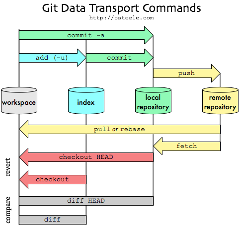
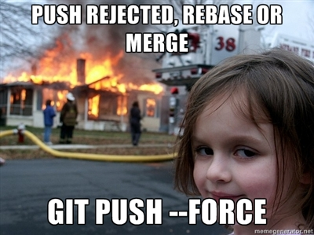

# <center>Git and Github</center>


---
# The Basic Cycle

Remember this and everything will be fine
```
git pull
<make your changes>
git add .
git commit -m'change description'
git pull
git push
```
---




---


# Getting started  

This flow works well for personal use and small teams, but with this many git newbs it would be chaos.
Instead we are going to have you each fork the curriculum repo, where you will have complete control,
        and then you can 'pull request' when you are ready to submit your work  

#### A Note for Windows Users  
We will work with Git as a command line utility.  The Unix command line is native on Mac OS X, but in order to emulate it on Windows you will need to download [Git Bash](https://git-for-windows.github.io/).

---


`$ git status`

git push or git push origin master
change from local master branch (my computer) and up to origin (<your_name>/sf17_ds6)

**Do this one time only**

`$ git config --global push.default simple`

---
### Sync repos

**Always "git pull" before sending up any changes**
```
$ git pull  (by default, it pulls from origin)
```

---
### Adding, committing a file
```
$ git add test.txt                     # sets working copy to staged copy
$ git status
$ git commit -m "add a simple file"    # staged copy to revision history
$ git push                             # send it to (my forked) repo
```
---
### Adding, committing multiple (all) files in a directory
```
$ git add .
$ git status
$ git commit -m "adding all files in this repo"
$ git push
```
---
### Adding, committing all .txt files in a directory
```
$ git add *.txt
$ git status
$ git commit -m "adding all txt files in this repo"
$ git push
```
---
### Adding, committing all .txt files that contain the word "llama" in a directory
```
$ grep “llama” . -rlw | xargs git add
$ git status
$ git commit -m "adding all the llama files in this repo"
$ git push
```
---
#### Sync repo
```
$ git pull upstream master
$ git push
```
---
## Pull Request

Go to your forked version
https://github.com/<your name>/sf17_ds6

Right column, go to "New pull request"

Click on green "Create pull request"

Fill in info at "Leave a comment"

Click on green "Create pull request" at bottom of page.

Look in this repo and see that file has been updated.

---

**Note:**  
GitHub:  commit every day, green dots show up on user home page; looks good for potential employers.


---
Don't worry its hard to mess up too badly




