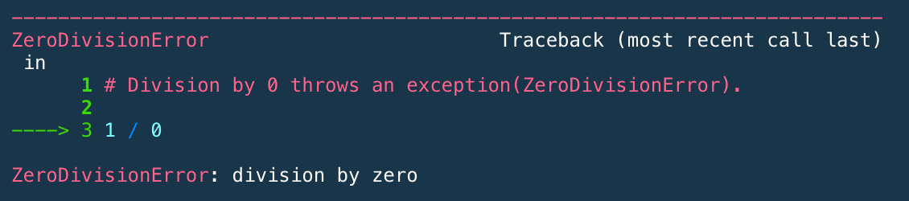
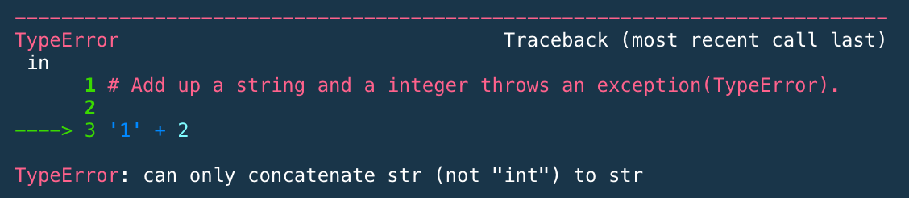
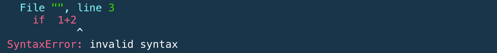
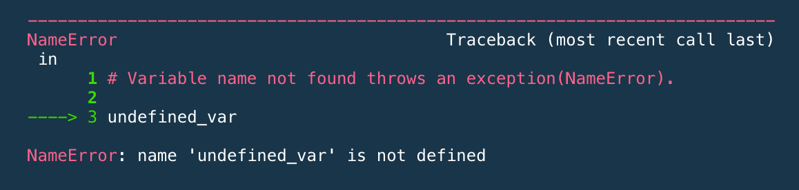
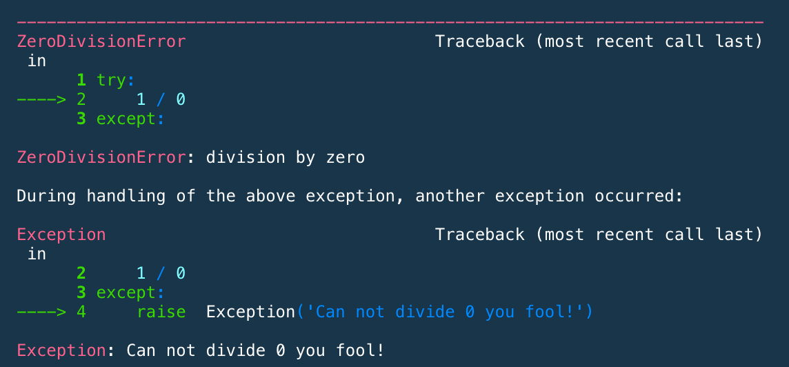

# Basic Python Notes
**Last Updated:** 10/22/19

<a id='home'></a>
## Contents

### [1.0 Basics](#a0)
- [1.1 Basic Objects](#a1)
- [1.2 Variables](#a2)
- [1.3 Basic Math](#a3)
- [1.4 Functions](#a4)
- [1.5 Comparison Operators](#a5)
- [1.6 Boolean Operators](#a6)
- [1.7 Strings](#a7)
- [1.8 Print String Format](#a8)

### [2.0 Data Structures](#b0)
- [2.1 List](#b1)
- [2.2 Tuples](#b2)
- [2.3 Set](#b3)
- [2.4 Dictionaries](#b4)

### [3.0 Control Flow](#c0)
- [3.1 Conditional Statements (if, elif, else)](#c1)
- [3.2 Loops](#c2)
- [3.3 Exceptions](#c3)

### [Appendix](#app)
- [A.1 Python Keywords](#d1)


<a id='a0'></a>

---

## 1.0 Python Basics

<a id='a1'></a>
[Back to Top](#home)

----

## 1.1 Basic Objects

- int, used to represent integers, e.g., 2, 5, or 100.
- float, used to represent real numbers, e.g, 2.75, 3.14.
- bool, used to represent Boolean values True and False.

``` python
print (type(1))
print (type(1.0))
print (type(True))
```
```
> <class 'int'>  
> <class 'float'>  
> <class 'bool'>
```
Change data type

```python
print (type(float(1)))
print (type(int(1.0)))
```
```
> <class 'float'>
> <class 'int'>
```
<a id='a2'></a>
[Back to Top](#home)

---
## 1.2 Variables

Variables are names that have been assigned to specific values or data. These names can be almost anything you want, but there are some restrictions and best practices.

**Restrictions**
- The name of a variable cannot start with a number.
- The name of a variable cannot contain some special characters like `.`, `$`, `%`, `+`, `&`, etc.
- Variables cannot be assigned the same name as a default or imported function (i.e., `type`, `print`, `for`).
- Variable names cannot contain spaces.

**Best Practices**
- Variable names should be lowercase.
- A variable's name should be representative of the value(s) it has been assigned.
- If you must use multiple words in your variable name, use an underscore to separate them.

```python
# Assigning a float:
x = 1.0
print (type(x))

# Assigning an int:
y = 1
print (type(y))

# Assigning a string:
z = '1'
print (type(z))
```
```
> <class 'float'>
> <class 'int'>
> <class 'str'>
```
Change value of objects
```python
x = 10.5
print ('The value of x is', x)
x = 'hello world!'
print ('The value of x is', x)
```
```
> The value of x is 10.5
> The value of x is hello world!
```
Assign value with 'input', formarly called raw_input
```python
name = input('type your name:  ')
print (name)
```
```
> type your name:  Mike
> Mike
```
<a id='a3'></a>
[Back to Top](#home)

----
## 1.3 Basic Math

- **`+`**  Exponentiation
- **`-`**  Subtraction
- __`*`__  Multiplication
- __`**`__  Exponentiation
- **`/`** Division (float)
- **`//`** Division (floor)
- **`%`** Modulo, returns the remainder when one integer is divided by another

```python
print (5 + 2)   # Addition
> 7

print (5 - 2)   # Subtraction
> 3

print (5 * -2)  # Multiplication
> -10

print (5 ** 2) # Exponentiation
> 25

print (5 / 2)    # Division (float)
> 2.5

print (5 // 2)  # Division (floor)
> 2

print (-5 // 2) # Division (floor) - with negative number
> -3

print (5 % 2)    # Modulo
> 1
```

Scientific notation in python. For example, 1.5e5 denotes the value 1.5× 105
```python
print (1.5e5)
> 150000.0
```

<a id='a4'></a>
[Back to Top](#home)

----
## 1.4 Functions

```python
def square(x):
    return x**2

print (square(4))
> 16
```

```python
def polynomial(x, a, b=0, c=0, d=0):
    result = a + b * x**1 + c * x**2 + d * x**3
    return result

print (polynomial(1, 2, 3))
> 5

print (polynomial(2, 2, d=-4))
> -30
```
Function calling another function
```python
def fun_one(n):
    return n * 5

def fun_two(m):
    return fun_one(m) + 7

fun_two(3)
> 22
```
Documentation Strings (docstrings)
```python
def hello():
    '''Print 'Hello World' and return None'''
    print ('Hello World')

hello()
> Hello World
```

<a id='a5'></a>
[Back to Top](#home)

----
## 1.5 Comparison Operators

**Comparison Operators**

- Less than: **`<`**
- Greater than: **`>`**
- Less than or equal to: **`<=`**
- Greater than or equal to: **`<=`**
- Equals: **`==`**
- Does not equal: **`!=`**

```python
print (1 > 1)
> False

print (1 < 1)
> False

print (1 >= 1)
> True

print (1 <= 1)
> True

print (1 == 1)
> True

print (1 != 1)
> False
```
List Comparison
```python
print ([1,2] == [1,2])
> True

print ([1,2] != [2,1])
> True
```

<a id='a6'></a>
[Back to Top](#home)

----
## 1.6 Boolean Operators

```python
print (True and True)
> True

print (True or  False)
> True

print (not True)
> False
```

<a id='a7'></a>
[Back to Top](#home)

----
## 1.7 Strings

```python
type('1324')
> str
```

```python
print (str(1234))   # convert int to string
> 1234

print (str(1234.0)) # convert float to string
> 1234.0

print (str(True))   # convert bool to string
> True
```
Length of the string
```python
len('Hello world')
> 11
```
Replace an element of a string
```python
s = 'Hello world'
s = s.replace('world', 'test')
print (s)
> Hello test
```
Change case
```python
s2 = 'THis IS teST tExT'
print (s2.lower()) #all lower case
> this is test text

print (s2.upper()) #all upper case
> THIS IS TEST TEXT

print (s2.title()) #capitalize first letter, rest lower case
> This Is Test Text
```
### Operators on strings
`∗` and `+` works for strings.

```python
# repeat 'a' 3 times
print (3 * 'a') 
> aaa

# join 'a', 'b' and 'c'
print ('a' + 'b' + 'c') 
> abc

# convert and join
print ('a' + str(123))
> a123
```

```python
# String Indexing
s = 'Hello world'

# 1. Indexing the first (index 0) character in the string:
print (s[0])
> H

# 2. Objects at indexes 0, 1, and 2
print (s[0:3])
> Hel

# 3. From index 6 up to the end of the string:
print (s[6:])
> world

# 4. No start or end specified:
print (s[:])
> Hello world

# 5. Index from the right side
print (s[-1])
> d

# 6. Define a step size of 2, i.e., every other character:
print (s[::2])
> Hlowrd
```

```python
# Exit character, use '\' ahead of ' to not mess up text
print ('This isn\'t flying, this is falling in style!')
> "This isn't flying, this is falling in style!"


# Use \n for new line
print ('Line One\nLine Two')
> Line One
> Line Two

# Use \t to tab in
print ('A list:\n\t- Bullet 1\n\t- Bullet 2\n\t\t- Bullet 3')
> A list:
>	- Bullet 1
>	- Bullet 2
>		- Bullet 3
```

```python
# Check if text ends with a string
x = 'Homer Simpson'
print (x.endswith('Simpson'))
> True
```


```python
# Check if string is only letters with isalpha().  Similar option with isalnum()
x = 'text'
y = 'text with spaces'
z = 'numbers12345'

print (x.isalpha())
> True

print (y.isalpha())
> False

print (z.isalpha())
> False
```
<a id='a8'></a>
[Back to Top](#home)

----
## 1.8 Print String Format

Here, %s, %i, %f are formatters, Python will take the variable on the right and put it in to replace the %s, %i or %f with its value.

- %s is used for strings
- %i or %d are used for integers
- %f is used for float numbers, can indicate 2 decimal points with %.2f

```python
print ('hello world!')
> hello world!

print ('hello %s!' % 'world')
> hello world!
```

```python
print ('The number is, %i!' %2019)
> The number is, 2019!

print ('The number is, %f!' %2019)
> The number is, 2019.000000!

print ('The number is, %.2f!' %2019)
> The number is, 2019.00!
```

```python
print ('5 ** 2 = %i' % (5 ** 2))
> 5 ** 2 = 25

print ('5 / 2 = %.2f' % (5 / 2))
> 5 / 2 = 2.50

print ('5 // 2 = %.2f' % (5 // 2))
> 5 // 2 = 2.00

print ('5 %% 2 = %.2f' % (5 % 2))
> 5 % 2 = 1.00
```
An alternative, more intuitive way of formatting a string
```python
s1 = 'value1 = {}, value2 = {}'.format(3.1415, 1.5)
s2 = 'value1 = {0}, value2 = {1}'.format(3.1415, 1.5)
s3 = 'value1 = {0}, value2 = {1}, value1 again = {0}'.format(3.1415, 1.5)

print (s1)
> value1 = 3.1415, value2 = 1.5

print (s2)
> value1 = 3.1415, value2 = 1.5

print (s3)
> value1 = 3.1415, value2 = 1.5, value1 again = 3.1415
```

<a id='b0'></a>

---

# 2.0 Data Structures

<a id='b1'></a>
[Back to Top](#home)

----
## 2.1 List

```python
fibonacci_numbers = [1, 1, 2, 3, 5, 8, 13, 21]
strings = ['a', 'b', 'c', 'd']
num_str_bool = ['a', 1, 'b', 2, 'c', 3, True, False]
list_of_lists = [fibonacci_numbers, strings, num_str_bool]

print (fibonacci_numbers)
> [1, 1, 2, 3, 5, 8, 13, 21]

print (strings)
> ['a', 'b', 'c', 'd']

print (num_str_bool)
> ['a', 1, 'b', 2, 'c', 3, True, False]

print (list_of_lists)
> [[1, 1, 2, 3, 5, 8, 13, 21], ['a', 'b', 'c', 'd'], ['a', 1, 'b', 2, 'c', 3, True, False]]
```
### Indexing and Slicing

```python
print (fibonacci_numbers[0]) # the first element
> 1

print (fibonacci_numbers[3]) # the fourth element
> 3

print (fibonacci_numbers[0:3]) # slicing
> [1, 1, 2]

print (fibonacci_numbers[3:]) # slicing
> [3, 5, 8, 13, 21]
```
### Searching and Appending
```python
# searching, the index whose values is 8
fibonacci_numbers.index(8) 
> 5
```
```python
fibonacci_numbers.append(34) # add one more element
print (fibonacci_numbers)
> [1, 1, 2, 3, 5, 8, 13, 21, 34]
```
### List Comprehension
```python
# add 1 to each number

new_list = [i + 1 for i in fibonacci_numbers]
print (new_list)
> [2, 2, 3, 4, 6, 9, 14, 22, 35]
```
```python
# for only even numbers add 1

[i + 1 for i in fibonacci_numbers if i % 2 == 0]
> [3, 9, 35]
```


```python
# list of length 3, stepping through each range at the same time

[i * j for i,j in zip(range(5,8),range(20,23))]
> [100, 126, 154]
```

```python
# list of length 9, stepping through each combination of i and j (for loop in a for loop)

[i * j for i in range(5,8) for j in range(20,23)]
> [100, 105, 110, 120, 126, 132, 140, 147, 154]
```

<a id='b2'></a>
[Back to Top](#home)

----
## 2.2 Tuple
Tuples are similar to lists in many ways, except they **can't be modified once you've created them.**

Tuples are defined between two parentheses instead of brackets.

```python
fib_numbers = (1, 1, 2, 3, 5, 8, 13, 21)
print (fib_numbers)
> (1, 1, 2, 3, 5, 8, 13, 21)
```

```python
fib_numbers[1] # indexing
> 1
```

```python
fib_numbers[1:5] # slicing
> (1, 2, 3, 5)
```

```python
fib_numbers.index(8) # searching
> 5
```

<a id='b3'></a>
[Back to Top](#home)

----
## 2.3 Set
A set is an unordered sequence of unique values. Members of a set must be hashable.
```python
set1 = {1, 2, 3}
set2 = {2, 3, 1}
print (set1 == set2)
> True
```
```python
# Note that the duplicated elements are automatically removed.

set3 = {1, 1, 2, 2, 3, 3, 3, 3, 3}
print (set3)
> {1, 2, 3}
```
### Operations on sets
- **difference:** Elements of the first set that are in the 2nd set
- **intersection:** Elements in both sets
- **union:** Elements that are in either set


```python
evens = {0, 2, 4, 6, 8, 10, 12}
integers = {0, 1, 1, 2, 3, 4, 5, 5, 5, 6, 7, 8, 9, 9, 8, 19}
```
The elements that appears in evens and not in integers.

```python
evens.difference(integers) # same as: evens - integers
> {10, 12}
```
The elements that appears both in evens and integers.
```python
evens.intersection(integers)
> {0, 2, 4, 6, 8}
```
The elements that appears in evens or integers.
```python
evens.union(integers)
> {0, 1, 2, 3, 4, 5, 6, 7, 8, 9, 10, 12, 19}
```

<a id='b4'></a>
[Back to Top](#home)

----
## 2.4 dictionary
A dictionary is a set of keys with associated values. The key must be hashable, but the value can be any object. You might know this as a hash map or key-value pairs.

```python
someone = {'sex': 'male', 'height': 6.1, 'age': 30}
print (someone)
> {'sex': 'male', 'height': 6.1, 'age': 30}
```

```python
print (someone.keys())
> dict_keys(['sex', 'height', 'age'])

print (someone.values())
> dict_values(['male', 6.1, 30])
```


```python
print (someone['age']) # index
> 30
```

```python
# Convert to a list of tuples
print (someone.items())
> dict_items([('sex', 'male'), ('height', 6.1), ('age', 30)])
```

```python
# Similar to set, dictionary is also unordered.

someone1 = {'sex': 'male', 'age': 30}
someone2 = {'age': 30, 'sex': 'male'}
someone1 == someone2
> True
```

### dictionary comprehension

```python
names = ['Mike','Tom','Dave','Lisa']

{i:n for i in range(len(names)) for n in names}
> {0: 'Lisa', 1: 'Lisa', 2: 'Lisa', 3: 'Lisa'}
```

<a id='c.0'></a>

---

# 3.0 Control Flow

<a id='c.1'></a>
[Back to Top](#home)

----
## 3.1 Conditional Statements (if, elif, else)

```python
def cond_function(x):
    if x % 2 == 0:
        print ('x is even')
    elif x < 10:
        print ('x is odd and less than 10')
    elif x > 20:
        print ('x is odd and greater than 20')
    else:
        print ('x is odd and between 10 and 20')

cond_function(13)
> 'x is odd and between 10 and 20'
```
```python
def nested_cond_function(x):
    if x % 2 == 0: 
        if x % 3 == 0 :
            print ('x can be divided by 2 and 3')
        else:
            print ('x can be divided by 2, but can not by 3.')
    else:
        if x % 3 == 0 :
            print ('x can be divided by 3, but can not by 2.')
        else:
            print ('x can not be divided by 2 or 3.')

nested_cond_function(13)
> 'x can not be divided by 2 or 3.'
```
```python
def multiple_conditions_function(x):
    div2 = x % 2 == 0
    div3 = x % 3 == 0

    if div2 and div3: 
        print ('x can be divided by 2 and 3')
    elif div2 and not div3: 
        print ('x can be divided by 2, but can not by 3.')
    elif not div2 and div3: 
        print ('x can be divided by 3, but can not by 2.')
    else:
        print ('x can not be divided by 2 or 3.')
multiple_conditions_function(13)
> 'x can not be divided by 2 or 3.'
```
```python
def multi_if_function(x):
    if x > 3:
        print ('greater than 3')
    if x > 5:
        print ('greater than 5')
    if x > 10:
        print ('greater than 10')

multi_if_function(13)
> 'greater than 3'
> 'greater than 5'
> 'greater than 10'
```

<a id='c.2'></a>
[Back to Top](#home)

----
## 3.2 Loops

### for loop

```python
for i in range(3):
    print (i)
> 0
> 1
> 2
```
### while loop

```python
i = 0

while i < 3:
    print (i)
    i += 1
> 0
> 1
> 2
```

```python
def binarySearchSquareRoot(x, eps = 1e-8):
    start = 0
    end = x
    mid = (start + end) / 2.0
    while abs(mid ** 2 - x) >= eps:
        if mid**2 > x:
            end = mid
        else:
            start = mid
        mid = (start + end) / 2.0
    return mid

binarySearchSquareRoot(100, 1e-15)
> 10.0
```

<a id='c.3'></a>
[Back to Top](#home)

----
## 3.3 Exceptions

Another flow control tool is the exception. They are used to indicate an unusual condition that needs to be handled higher up on the stack.

```python
# Division by 0 throws an exception(ZeroDivisionError).

1 / 0
```


```python
# Add up a string and a integer throws an exception(TypeError).

'1' + 2
```

```python
# Wrong syntax throws an exception(SyntaxError).

if  1+2
```

```python
# Variable name not found throws an exception(NameError).

undefined_var
```


### Try and Except
```python
try:
    1 / 0
except:
    raise  Exception('Can not divide 0 you fool!')
```


```python
try:
    1 / 0
except:
    print ('Can not divide 0 you fool!')

print ('hi, I keep running!')

> 'Can not divide 0 you fool!'
> 'hi, I keep running!'
```

We can also deal with each particular type of exception. We have seen these exceptions:

- **SyntaxError:** can’t parse program
- **NameError:** name not found
- **TypeError:** operand doesn’t have correct type
- **ZeroDivisionError:** integer division or modulo by zero.

```python
def divide(x, y):
    try:
        result =  x / y
    except ZeroDivisionError:
        result = None
    except TypeError:
        result = divide(float(x), float(y))
    return result

print (divide(3, 0))
> None

print (divide(3, 1))
> 3.0

print (divide(3, '1'))
> 3.0
```
Other extensions to try:

- **else:** executed when execution of associated try body completes with no exceptions.
- **finally:** always run.


```python
def divide2(x, y):
    try:
        result =  x / y
    except ZeroDivisionError:
        result = None
    except TypeError:
        result = divide2(float(x), float(y))
    else:
        print ("result is", result)
    finally:
        print ("done!")
        return result
```
```python
print (divide2(2, 1))
> result is 2.0
> done!
> 2.0
```

```python
print (divide2(2, 0))
> done!
> None
```

```python
print (divide2(2, '1'))
> result is 2.0
> done!
> done!
> 2.0
```

<a id='app'></a>

---

# Appendix

<a id='d1'></a>
[Back to Top](#home)

---
## A.1 Python Keywords

```python
import keyword
keyword.kwlist
```
['False',  
 'None',  
 'True',  
 'and',  
 'as',  
 'assert',  
 'async',  
 'await',  
 'break',  
 'class',  
 'continue',  
 'def',  
 'del',  
 'elif',  
 'else',  
 'except',  
 'finally',  
 'for',  
 'from',  
 'global',  
 'if',  
 'import',  
 'in',  
 'is',  
 'lambda',  
 'nonlocal',  
 'not',  
 'or',  
 'pass',  
 'raise',  
 'return',  
 'try',  
 'while',  
 'with',  
 'yield']  


